# Tutorial "Language Engineering with The GEMOC Studio", MODELS, Sep. 2017

* [Scope](#scope)
* [Program](#program)
* [Materials](#materials)

This tutorial provides a practical approach for developing and integrating various Domain-Specific (modeling) Languages (DSLs) used in the development of modern complex software-intensive systems, with the main objective to support abstraction and separation of concerns. The tutorial leverages on the tooling provided by the GEMOC studio to present the various facilities offered by the Eclipse platform (incl., EMF/Ecore, Xtext, Sirius) and introduces the advanced features to extend a DSL with a well-defined execution semantics, possibly including formal concurrency constraints and coordination patterns. From such a specification, we demonstrate the ability of the studio to automatically support model execution, graphical animation, omniscient debugging, concurrency analysis and concurrent execution of heterogeneous models. The tutorial is composed of both lectures and hands-on sessions. Lectures introduce the foundations of language engineering, and give the basics of the GEMOC studio and the underlying concepts. Hands-on sessions allow participants to experiment on representative concrete use cases.

## Scope

During this tutorial, the participants will extend a given finite state machine DSL in terms of syntax and semantics using the language workbench of the GEMOC Studio.

## Legend

* :warning: Read carefully, tricky details follow.
* ​:no_entry: Breaking changes. You should download a new version of the language under development for temporal reasons. You may proceed with you local changes, but we might not be able to support its evolution due to the short time frame of the tutorial. 
* :bulb: some tips to make your live easier :)

## Program

- [Part 1. General introduction](#part-1-general-introduction)
- [Part 2. Breathe Life Into Your Designer!](#part-2-breathe-life-into-your-designer)
  - [2.1 Overview the language example provided for the tutorial](#21-overview-the-language-example-provided-for-the-tutorial)
  - [2.2 Playing with the modeling workbench](#22-playing-with-the-modeling-workbench)
  - [2.3 Complementing the execution semantics](#23-complementing-the-execution-semantics)
  - [2.4 Deploying the modeling workbench and playing with the example model](#24-deploying-the-modeling-workbench-and-playing-with-the-example-model)
- [Part 3. Weave Concurrency Constraints Into Your DSL!](#part-3-weave-concurrency-constraints-into-your-dsl)
- [Part 4. Wrap-up and discussion](#part-4-wrap-up-and-discussion)

## Materials

+ Use the latest [GEMOC Studio](http://gemoc.org/studio.html) with a [Java 1.8 JDK](http://www.oracle.com/technetwork/java/javase/downloads/jdk8-downloads-2133151.html), and clone the [tutorial's repository](https://github.com/gemoc/MODELS2017Tutorial.git).
+ The slides for the tutorials are available [here](https://github.com/gemoc/MODELS2017Tutorial/blob/master/slides/tutorial-slides.pptx).
+ Most of the documentation on the GEMOC approch is available [here](http://gemoc.org/gemoc-studio/publish/guide/html_single/Guide.html).

You can refer to the documentation about the GEMOC studio at any time. Note also that we will rely on various tools from the EMF ecosystem (e.g., EcoreTools, Sirius...), and we will refer to their respective documentations accordingly. 


## Part 1. General introduction

This part introduces the structure and goals of the tutorial. Moverover it covers an introduction to software language engineering, and GEMOC (incl. the initiative and the studio). The slides are available [here](https://github.com/gemoc/MODELS2017Tutorial/blob/master/slides/tutorial-slides.pptx).

## Part 2. Breathe Life Into Your Designer!

In this part, you will implement from-scratch a new modeling language that support the behavioral definition of a system in terms of a set of simplified Finite State Machines (FSM), communicating each others through buffers. In the first step, you will use the language workbench to define the abstract and concrete syntaxes, as well as the behavioral semantics. Then you will launch the modeling workbench to use your new modeling language to edit models, and then execute, animate and debug them.

### 2.1 Overview the language example provided for the tutorial

- Open your GEMOC Studio
- Go to a new workspace.
- Go to File -> import -> Git -> Projects from Git (import **all projects from /code/languagewb/**)

This produces the general structure of a xDSML workspace, which comprises the projects for all the different parts of an executable DSML (projects org.gemoc.models17.fsm.*):

- *org.gemoc.models17.fsm* contains the description for the FSM language into the Melange file (this project can be created from New -> Project -> GEMOC Sequential xDSML project). The Melange file is used for assembling the abstract syntax and the execution semantics in order to automatically provide the structural interface (in the form of an Ecore model combining the abstract syntax and the structural information from the execution semantics) required to use the EMF ecosystem (see org.gemoc.models17.fsm.xfsm). 
- *org.gemoc.models17.fsm.model* contains the description of the abstract syntax for the FSM language. The abstract syntax is descriptbed using Ecore (this project can be created from New -> Project -> Ecore Modeling Project, or from a right clic on the Melange file -> GEMOC Language -> Create Domain Model Project from language)
- *org.gemoc.models17.fsm.k3dsa* contains the Kermeta description of the execution semantics for the FSM language. The execution semantics is describes using Xtend and additional annotations provided by Kermeta to weave the semantics to the abstract syntax (note that the GEMOC studio also provide other solutions for the description of the execution semantics such as ALE, Xmof, Java...)
- *org.gemoc.models17.fsm.xfsm.design* contains the graphical representation of both the editor and the animator. The graphical representation is defined using Sirius. 

At this step, you must generate the following artefact: 
- from the Melange file you must generate the structural interface of the language (right clic on the Melange file -> Melange -> Generate All). This will create the *org.gemoc.models17.fsm.xfsm* that contains the structural interface of your executable language, used for defining the animation layer with Sirius (contains in the .design project), and later in this tutorial the concurrency model. 
- from the Melange file, you can generate the domain-specific trace backend in a project named *org.gemoc.models17.fsm.xfsm.trace* (right clic on the Melange file -> GEMOC Language -> Generate Multidimensional Trace Addon project for language) in order to support omniscient facilities in the debugger of the modeling workbench (i.e., step backward, in addition to step forward).
- from the genmodel file of the org.gemoc.models17.fsm.xfsm project, you must generate the edition layer that will use Sirius for the editor (open the genmodel, right clic on the root -> Generate All).

### 2.2 Playing with the modeling workbench

From your first instance of Eclipse (i.e. the language workbench), you must lunch a new Eclipse instance (i.e. the modeling workbench) where the plugins developped in the workspace of the language workbench will be deployed: Run -> Run Configurations -> Eclipse Application (a launch configuration is provided to you in the project of the Github repository)

In the modeling workbench, you must import the example model provided for the tutorial, from [MODELS2017Example](https://github.com/gemoc/MODELS2017Tutorial/blob/master/code/modelingwb/exampleModels) (**/code/modelingwb/exampleModels/**). In the project, open the file */models/testModels.aird*, and in the project explorer, open the corresping diagram. See below:

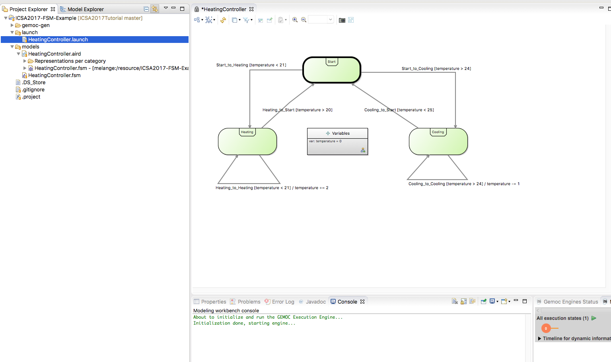

From here, you can **right click** on the launch configuration *testSequentialExecution.launch*, **debug as** testSequentialExecution and start debugging your model. Note that for this purpose the debug view proposes to open, click yes. You have a typical eclipse debug environment with access to dynamic variables, step into, etc. Additionnaly, you have the multidimensional trace (if not open, choose _windows_ -> _show view_ -> _others_ -> multidimensional...). This last view is dedicated to your model and allos you to navigate in the trace in a multidimensional way (do not hesitate to pleasantly yell at us if you want more information)  

### 2.3 Complementing the execution semantics

The execution semantics of FSM (in the form of an operational semantics, i.e., an interpreter) are defined in the file tfsmAspects.xtend of project org.gemoc.models17.fsm.k3dsa. This file which employs [Kermeta 3 (K3)](http://www.kermeta.org) and the [Interpreter Design Pattern](https://en.wikipedia.org/wiki/Interpreter_pattern) to describe the execution semantics of FSM models and its contents is woven into the metamodel of your executable DSL (i.e., XSFSM, not FSM!). 

In tfsmAspects.xtend, you have aspects for all classes of your metamodel. Some of these aspects use annotations to define specific execution functions and entry points (_e.g._, @InitializeModel). 

**Execution Functions**

The execution functions define how the execution data evolve during the execution of the model. Execution functions can be implemented by defining the body of a method. These methods can be annotated with the **@Step** annotation in order to be considered as observable execution steps, especially in the step-by-step execution mode of the debugger.

**Entry Points**

An additional annotation **@Main** must be used to annotate the entry point of the interpreter. Several methods can have the same annotation and will be proposed as possible entry points in the launch configuration at debug time. 


:warning: We left two methods unimplemented with "TODO". Try to implement these two methods to complete the behavior of the model to your taste.

_SOLUTION WILL APPEAR HERE_

```java
    @Aspect(className=State)
    class StateAspect {
	@Step
	def public void step(String inputString) {
		// Get the valid transitions	
		val validTransitions =  _self.outgoing.filter[t | inputString.compareTo(t.trigger) == 0]
		
		if(validTransitions.empty) {
			//just copy the token to the output buffer
			_self.fsm.outputBuffer.enqueue(inputString)
		}
		
		if(validTransitions.size > 1) {
			throw new Exception("Non Determinism")
		}
		
		// Fire transition first transition (could be random%VT.size)
		if(validTransitions.size > 0){
			validTransitions.get(0).fire
			return
		}
		return
		
	}
    }
```

```java
    @Aspect(className=Transition)
    class TransitionAspect {
    	@Step
	def public void fire() {
		println("Firing " + _self.name + " and entering " + _self.tgt.name)
		val fsm = _self.src.fsm
		fsm.currentState = _self.tgt
		fsm.outputBuffer.enqueue(_self.action)
		fsm.consummedString = fsm.consummedString + fsm.underProcessTrigger
	}
    }
```


After finishing or to see the effect of your code, run "generate all" on the Melange model of project org.gemoc.models17.fsm, which regenerates a new language implementation.

<!--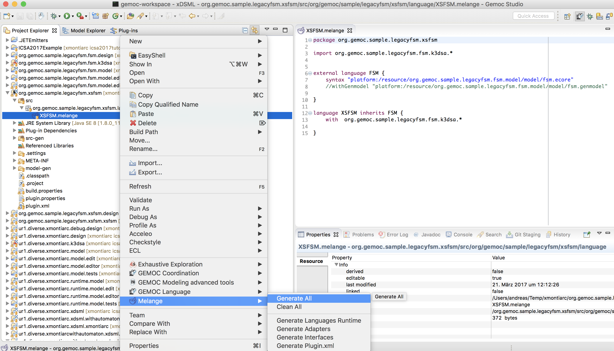-->

### 2.4 Deploying the modeling workbench and playing with the example model

goto 2.2 and see the differences ;)  
:bulb: you can launch the modeling workbench in debug mode. If so, you do not need to restart the modeling workbench after each change in the semantics (you still need to generate all on the Melange file). Even better you can dynamically provide the new semantics during a debug of your model (at your own risks ;) )


Now, you should be able to run and debug your language according to your desired semantics. Here is a screenshot of a classical debugging session.

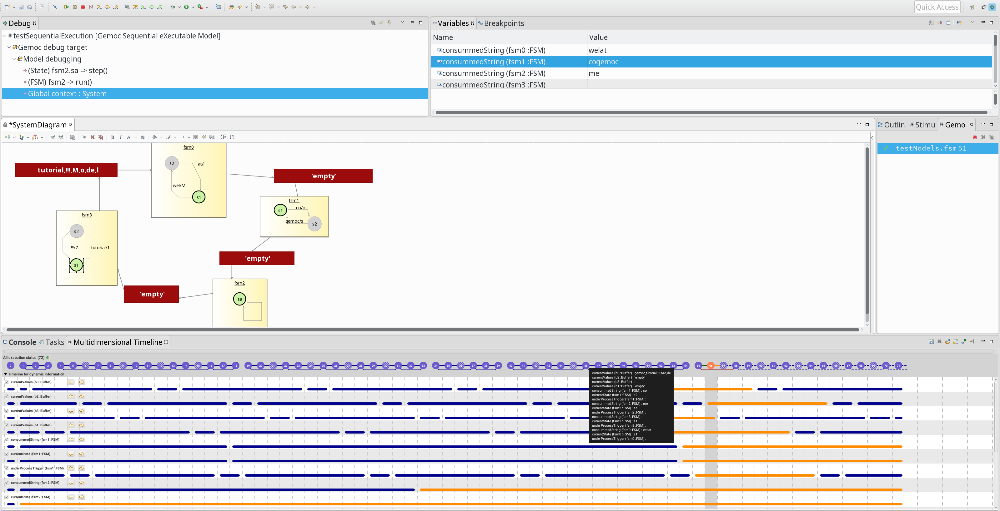

:bulb: you can also add breakpoints on State (right click on a State -> gemoc -> toggle breakpoint). Then you can run until an execution function is called on the state !

:no_entry: The solution of the previous step is available from the [solution folder](https://github.com/gemoc/MODELS2017Tutorial/tree/master/code/incrementalSolutions/languageWB_DSAOK_allgenerated), if you had any problems with recreating the new semantics or experimented too much, please download it, clear your language workbench workspace and import the projects in the archive. Then run the modeling workbench on top of these projects.

If you have time, you can experiment how the language designer or a debugger can augment the animation of the model with new information. For instance, something easy to do is to add a new representation in the _Animation_ layer of the provided odesign file (project org.gemoc.models17.fsm.xfsm.design/description/xfsm.odesign) to show the string which has been consummed by each fsm. If you are too impatient and are looking for the resulting file, we provide it [here](https://github.com/gemoc/MODELS2017Tutorial/tree/master/code/incrementalSolutions/newAnimationRepresentation/xfsm.odesign)   

## Part 3. Weave Domain-Specific Concurrency Constraints Into Your DSL!
### Introduction

In the previous parts you defined an operational semantics for our little communicating FSM language. Based on that you were able to simulate and debug the models that conform this language.
If you have a careful look at the given semantics, you can see that the call to the *run()* of each FSM depends on the order the FSMs are stored in the *ownedFsms* collection. This mean that we restricted the semantics to be sequential and in this specific order. However, as soon as a FSM has data in its input buffer, it can be ran; possibly concurrently with other FSMs (_e.g._, pipelined). In this section we will replace the *main()* method of our operational semantics to specify the concurrency model of our language.

### Changing the language specification from sequential to concurrent
:warning: take care to make these actions in the correct order to avoid having both natures and that can corrupt the plugin configuration.

The first step consists in changing the nature of the language project from sequential to concurrent:
- right click on the *org.gemoc.models17.fsm* project, go to 'Configure' and choose 'Remove Sequential xDSML Project Nature'
- right click on the *org.gemoc.models17.fsm* project, go to 'Configure' and choose 'Add Concurrent xDSML Project Nature'

Behind the scene, the GEMOC studio is creating new artifacts and dependencies to deal with the concurrent execution engine. Please respect the order of the two previous actions to avoid a conflict between the two natures.

### Creation of the DSE and MoCCML mapping project
The second step consists in using the wizards to create a project dedicated to the specification of Domain Specific Events (DSE) and the way they are constrained each other.

- right click on the fsm.melange file, choose 'GEMOC Language' and click on 'Create DSE project for Language' 

A pop-up will open and ask you to configure the project:
- Choose the language to be equipped by a concurrent specification (you should have only one, XFSM)
- Choose the project name, default proposition is fine.
- in the three fields:
	- Choose the XFSM.ecore file by browsing in the first field.
	- Choose the root of the language (i.e., Model::System') in the second field by browsing.
	- Choose the name of the file in which DSE and MoCCML mapping will be specified in the third field (e.g., xFSM)

At this point it creates the new project and complete the *melange* file with the location of the so called ECL file (For Event Constraint Language). This last file is the one we will modify now. It is based on OCL and borrow most of the syntax from it.


​:no_entry: if you experimented problems with the previous steps, you can import the projects in [this archive](https://github.com/gemoc/MODELS2017Tutorial/tree/master/code/incrementalSolutions/languageWB_concurrentNoDSE/languageWB_concurrentNoDSE.zip) into your workspace.

### Modification of the ECL file

the ECL file follows the same format and syntax than OCL files.
It starts with the import of the metamodel on with the concurrency semantics must be given.

Then 2 specific imports are added (*ECLImport*). They are used to import MoCC specific constraint to be used in the ECL mapping. As we will see later, new constraints can be defined to fit the DSML concurrency semantics. For now, we will use the ones predefined in the CCSL librairies. The description of some of the available constraints will be given later.

Once imports are done, you can define new DSE in the context of your metaclasses and new constraint between these DSE to represent the desired partial ordering between the events.

#### DSE definition

It is now time to wonder what are the actions (DSA) we want to control with the concurrency model. There is no single solution here, it depends on the behavioral semantics you want to give to your language. For each action that will be controlled by the concurrency model, we define a *Domain Specific Event* (DSE). A DSE is defined in the context of a MetaClass of the language. Then, when applied on a specific model, for each instance of this metaclass, an instance of the DSE will be generated. Then, each occurrence of this event will result in a call to the action.

The syntax is the following:

> **context** _YouMetaClass_  
>&nbsp;&nbsp;&nbsp;&nbsp; **def** : _theDSEName_ : **Event** = self._theFuntionToCall()_

note that the function to call is optional (if no action must be called when the event occurs). 


**TODO:** According to the remark considering the previously defined *main* function, try to define the appropriate DSE for the tutorial


_SOLUTION WILL APPEAR HERE_

> **context** FSM  
>&nbsp;&nbsp;&nbsp;&nbsp; **def** : runIt : **Event**  = self.run()  


Now that the DSEs are defined, because no constraints between them have been defined, they are independent and can occurs opportunistically at any time. If you want to test such behavior, start the modeling workbench and before to start the debug of your executable model, you must create a concurrent Debug Configuration like the following one:

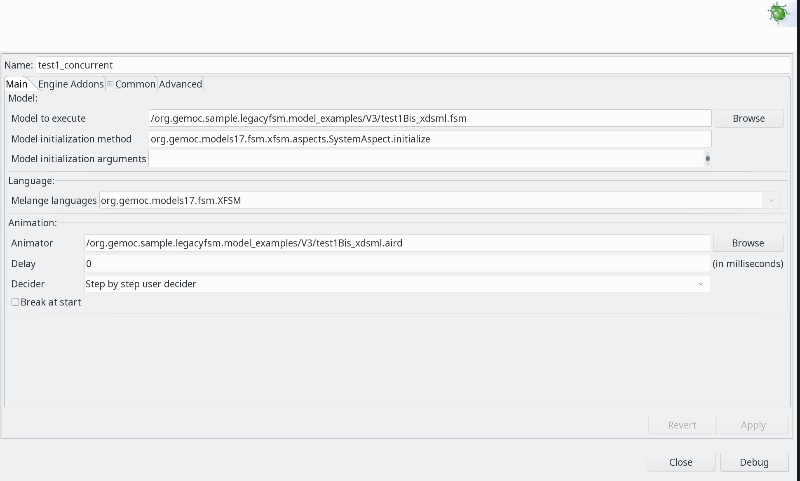
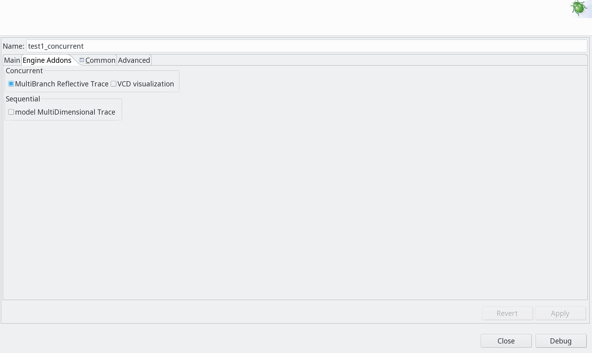

Then click on debug. It opens the model with the animation layer and you have a view named _Concurrent Logical Steps_ where all the acceptable actions (according to the concurrency model) are proposed. In this case, since no constraints are defined between the DSEs, the 2^4 interleavings are proposed:

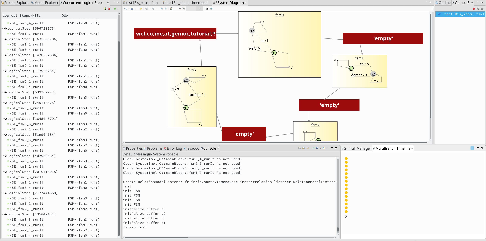

Note on the screenshot the multibranch trace with its 16 yellow bullets. EAch of them represents a possible step in the concurrent logical step view.

In order to constrain the DSE to make the concurrency model appropriate, we need first to spec a bit about the constraints provided in the libraries imported at the begin of the ecl file. These librairies contains, amongst some others, the following constraints:

- relation Precedes: e1 precedes e2 means that the ith occurrence of e1 arrives before the ith of e2  

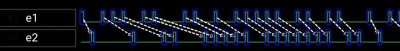

  relation Coincides: e1 coincides with e2 means that the ith occurrence of e1 arrives synchronously with the ith of e2  
 
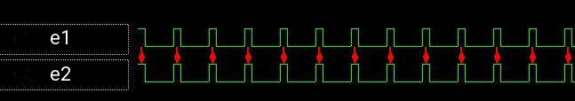

  relation Excludes: e1 excludes with e2 means that none of the occurrences of e1 arrives synchronously with one of e2  
 


  expression DelayedFor: res = e1 DelayedFor N on e2 means that for each occurrences of e1 between two occurrences of e2, there is an occurrence of res after N occurrences of e2. A special case is res = e1 delayedFor N on e1. In this case the N first occurrences of e1 are removed in res.  

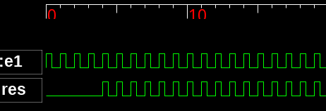

**TODO:** According to this, try to specify the constraints between the DSEs so that a FSM can run only when a data have been written first in its inputBuffer (or if some initial data were already there).

The syntax is making use of OCL invariants and the syntax is the following:

> **context** _YourMetaClass_  
>&nbsp;&nbsp; **inv** _InvariantName_ :  
>&nbsp;&nbsp;&nbsp;&nbsp; -- any guards (i.e., boolExpr implies..) and internal definitons (i.e.,  let..in)  
>&nbsp;&nbsp;&nbsp;&nbsp; -- note that this is a place where Event Expressions can be used  
>&nbsp;&nbsp;&nbsp;&nbsp; -- e.g., **let** eventName : **Event** = **Expression** _expressionName_(param1, param2, ...) **in**  
>&nbsp;&nbsp;&nbsp;&nbsp; **Relation** _relationName_(param1, param2, ...)  

:bulb: At any time, after saving your ECL file, you can relaunch you model debug to test the new concurrency model (without the need to restart the modeling workbench

_SOLUTION WILL APPEAR HERE_

> **context** Buffer:  
>&nbsp;&nbsp; **inv** : WriteBufferReadNoInitialValue:   
>&nbsp;&nbsp; (self.initialValue.size() = null **or** self.initialValue->size() = 0) **implies**  
>&nbsp;&nbsp;&nbsp;&nbsp; **Relation** Precedes(self.incomingFSM.runIt, self.outgoingFSM.runIt)  

>&nbsp;&nbsp; **inv** : WriteBufferReadWithInitialValue:  
>&nbsp;&nbsp; (self.initialValue.size() > 0) **implies**  
>&nbsp;&nbsp;&nbsp;&nbsp;**let** initialSize : **Integer** = self.initialValue.tokenize(',')->size().oclAsType(Integer) **in**  
>&nbsp;&nbsp;&nbsp;&nbsp;**let** allReadsButInitialOnes : **Event** = **Expression** DelayFor(self.outgoingFSM.runIt, self.outgoingFSM.runIt, initialSize) **in**  
>&nbsp;&nbsp;&nbsp;&nbsp; **Relation** Precedes(self.incomingFSM.runIt, self.outgoingFSM.runIt)  


​:no_entry: if you do not want to copy/paste the previous solutions, you can import the projects in [this archive](https://github.com/gemoc/MODELS2017Tutorial/blob/master/code/incrementalSolutions/languageWB_concurrentDSEOK/languageWB_concurrentDSEOK.zip) into your workspace.

You can also try to add a constraint to allow the execution of only one FSM at a time but without forcing the order like in the sequential semantics.

:bulb: you can use the multi branch time to jump in the past and explore a new future by choosing new scheduling orders

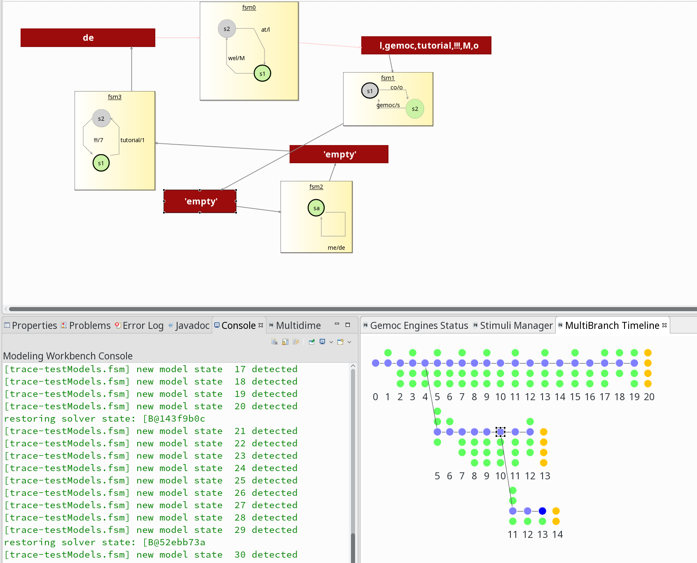

:bulb: You can also explore the whole scheduling state space. For that, right click on the .timemodel -> TimeSquare -> Compute State Space

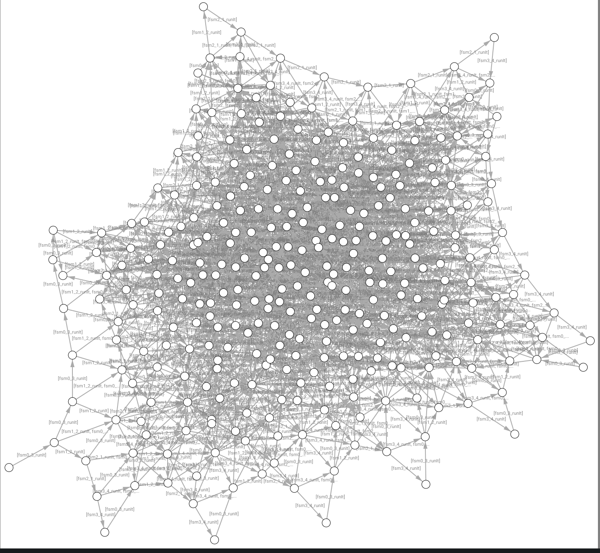


### Defining a Domain Specific Concurrent Constraint

As you can see from the second invariants we defined, it can be tricky, if you do not master logical time constraints, to define a constraint from the low level primtives that are offered. Fortunately, in this case you can define a Domain Specific constraint that encodes the concurrency constraints as a MoCCML automata.

For instance, you can download [this project](https://github.com/gemoc/MODELS2017Tutorial/tree/master/code/incrementalSolutions/MoCCMLDomainSpecificConstraint) from the repo and import it into your language workbench. In this project, we defined the follogin automata
 
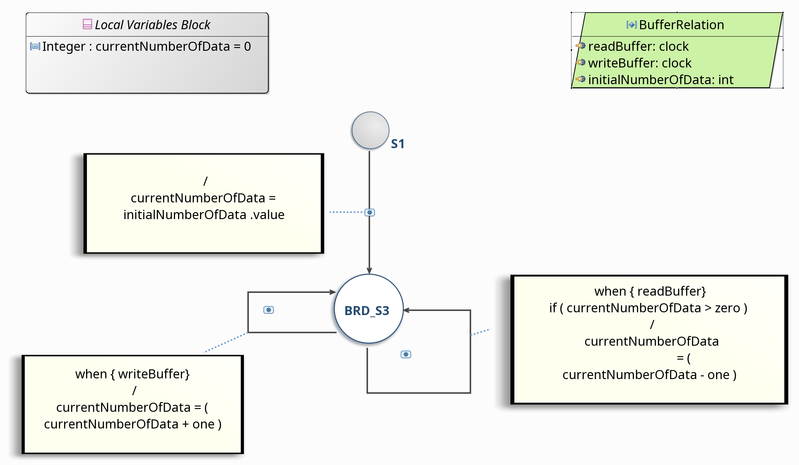
 
**TODO:** try to use this automata in the ECL file and test it in the modeling workbench. If you wish, you can also try to add a maximum size to the buffers :)

_SOLUTION WILL APPEAR HERE_


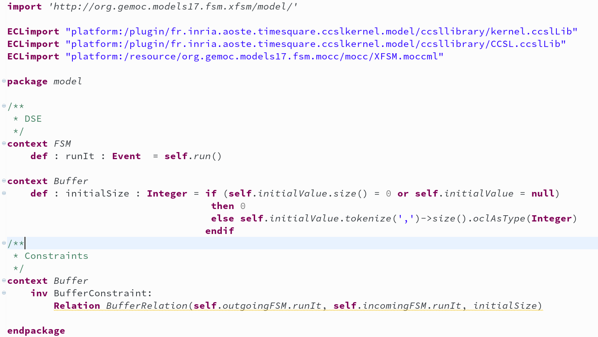


## Part 4. Wrap-up and discussion

See slides.
